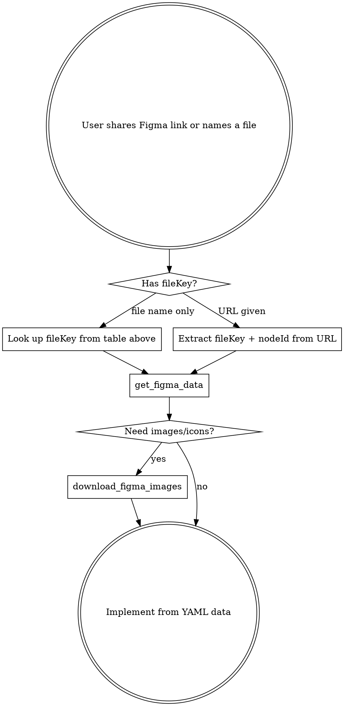

# Figma MCP

MCP server `figma-dev` (Framelink `figma-developer-mcp`) provides read access to Figma files.

## Design Files

### Altairika Team
| File | fileKey | Description |
|------|---------|-------------|
| Altairika - Virtual Encyclopedia | `IFZH08q7QaYrz8QnrMr7xv` | All design explorations and concepts |
| Shablon anonsa | `TODO` | Announcement templates |
| Shablon posta | `TODO` | Post templates |
| Brendbuk | `TODO` | Brand book: colors, fonts, logos |

### FranchCamp Team
| File | fileKey | Description |
|------|---------|-------------|
| Obschiy fayl | `TODO` | FranchCamp general designs |
| Shablon posta | `TODO` | FranchCamp post templates |

### Design Team
| File | fileKey | Description |
|------|---------|-------------|
| Altairium | `TODO` | Altairium project |
| Arkhiv | `TODO` | Design archive |

## Tools

### `get_figma_data`

Extracts layout, content, visuals, and component info as simplified YAML.

**Parameters:**
- `fileKey` (required) — from URL: `figma.com/design/<fileKey>/...`
- `nodeId` (optional) — from URL param `node-id=<nodeId>`, format `1234:5678`. **Always use if present in URL.**
- `depth` (optional) — **do NOT use** unless user explicitly asks

**Usage pattern:**
1. User shares Figma link or references a design file
2. Extract `fileKey` and `nodeId` from URL
3. Call `get_figma_data` with those params
4. Use returned YAML to implement the design

### `download_figma_images`

Downloads SVG/PNG/GIF assets from Figma nodes.

**Parameters:**
- `fileKey` (required) — same as above
- `nodes` (required) — array of `{nodeId, fileName, imageRef?, gifRef?}`
- `localPath` (required) — relative path for saving (e.g. `public/images`)
- `pngScale` (optional) — export scale, default `2`

## Workflow

## Gotchas

- **Auto Layout recommended** in Figma — floating elements translate poorly to code
- **Work section by section** — full-page designs overwhelm context window
- **Name your frames** — "Frame 123" produces generic code
- Node IDs: dashes in URLs auto-convert to colons for API
- `depth` param: omit it (fetches all layers, which is correct)
- Rate limits based on file **owner's** plan, not your token's account
